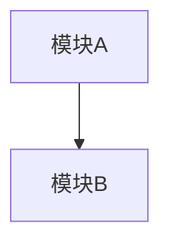
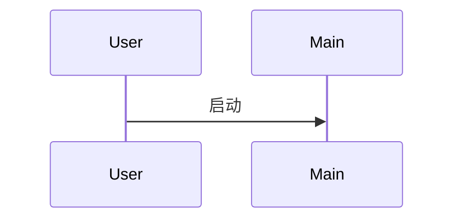

# SKILL: source_code_analysis

## 一句话简介
对 C/C++/Python/Java/Go 等项目进行完整的源码分析：逐文件读取、提取类/函数/接口、总结功能、按目录汇总、分析项目架构与执行流程、识别潜在 bug 与优化点，最终生成 Markdown 格式的详细分析报告。

---

## 适用场景（什么时候用）
- 用户要求"分析项目源码"、"理解项目架构"、"梳理执行流程"
- 需要全面了解一个陌生项目的功能模块和代码结构
- 需要识别项目中的 bug、安全风险或性能优化点

---

## 依赖的工具（由宿主系统提供）
必须使用的工具：
- `list_source_files(path, max_files?, extensions?) -> {count, files[]}`：列出目录下所有源代码文件
- `list_dir(path) -> entries[]`：列出目录内容，了解项目结构
- `read_source_file(path, start?, max_chars?) -> {content, total_lines}`：读取源代码文件
- `extract_cpp_functions(path) -> {functions[], classes[]}`：从 C++ 文件中提取函数和类
- `extract_functions(path) -> {functions[]}`：从 Python 文件中提取函数
- `walk_dir(path, max_depth?, max_files?) -> {items[]}`：遍历目录结构
- `batch_read_source_files(paths[], max_chars_per_file?) -> {results[]}`：批量读取多个文件（可选）

---

## 标准流程（必须严格遵守）

### Step 1：获取完整文件列表
- 调用 `list_source_files(".", max_files=500)` 获取项目所有源文件
- **重要**：记录文件总数，不能只读取部分文件

### Step 2：按目录分组文件
- 使用 `list_dir` 了解有哪些子目录
- 将文件按目录分组，例如：
  ```
  src/
    - base/
    - cache/
    - cluster-management/
    - crypto/
    - discovery/
    - ds/
    - essential/
    - http/
    ...
  ```

### Step 3：逐文件读取分析（必须逐个读取，不能跳读）
对每个文件执行以下操作：

1. **读取文件内容**：
   - 调用 `read_source_file(path)` 读取完整内容
   - 如果文件太大（>50000字符），先读取前 50000 字符

2. **提取函数和类**：
   - C++ 文件调用 `extract_cpp_functions(path)`
   - Python 文件调用 `extract_functions(path)`
   - 其他语言基于 regex 或 ast 自行分析结构

3. **记录分析结果**：
   为每个文件记录：
   ```json
   {
     "file": "路径/文件名.ext",
     "summary": "一句话功能描述",
     "classes": [{"name": "类名", "methods": ["方法1", "方法2"]}],
     "functions": [{"name": "函数名", "purpose": "功能描述"}],
     "key_includes": ["包含的头文件/模块"],
     "notes": "特殊实现、bug 风险、优化建议"
   }
   ```

4. **验证已读取**：
   - 确认当前文件已记录在分析结果中
   - **必须读取完当前目录的所有文件后，才能进入下一步**

### Step 4：按目录汇总
对每个目录，汇总该目录下所有文件的功能：
```markdown
## 目录：src/xxx

### 核心功能
- [描述该目录在整个项目中的作用]

### 包含文件
| 文件 | 功能 |
|------|------|
| file1.cpp | 功能1 |
| file2.cpp | 功能2 |

### 模块内交互关系
- [描述该目录下文件之间的调用关系]
```

### Step 5：项目总体分析
生成项目架构文档，包括：

1. **项目核心目标**
   - 该项目解决什么问题
   - 主要应用场景

2. **系统架构**
   - 模块划分（按目录）
   - 模块间依赖关系
   - 使用 Mermaid 图展示架构

3. **执行流程**
   - 主程序入口（main.cpp）
   - 关键业务流程
   - 使用 Mermaid 图展示数据流/控制流

4. **模块详解**
   - 对每个主要模块，详细说明：
     - 核心类/接口
     - 关键函数
     - 数据结构
     - 业务流程

### Step 6：Bug 与优化建议
识别并报告：
- 潜在的 bug（空指针、资源泄漏、竞态条件等）
- 性能优化点
- 安全风险
- 代码规范问题

### Step 7：生成 Markdown 报告
使用 `write_text_file` 将分析结果保存为 `project_analysis.md`

---

## 强制约束（必须遵守）

1. **不能跳读文件**：必须读取每个文件后才能进行下一步
2. **不能只读部分文件**：如果项目有 100 个文件，必须读取全部 100 个
3. **分批处理**：如果文件过多（>100），可以分批读取：
   - 批次1：读取前 50 个文件
   - 批次2：读取下 50 个文件
   - ...
4. **记录进度**：每完成一个目录，在输出中标注已分析文件数/总文件数
5. **诚实报告**：如果某些文件无法读取（如权限问题），必须注明

---

## 输出格式
最终输出必须包含：

```markdown
# 项目源码分析报告

## 1. 项目概述
- 项目名称
- 核心目标
- 技术栈

## 2. 项目结构
```
[目录树]
```

## 3. 逐文件分析
### 3.1 src/base/
| 文件 | 功能 | 关键类/函数 |
|------|------|------------|
| xxx.cpp | xxx | ClassA, func1 |

### 3.2 src/cache/
...

## 4. 目录功能汇总
### src/base/
...
### src/cache/
...

## 5. 项目架构
### 5.1 模块划分
...

### 5.2 架构图


## 6. 执行流程


## 7. 模块详解
### 7.1 xxx 模块
...

## 8. Bug 与优化建议
### 8.1 潜在 Bug
- [问题描述]

### 8.2 优化建议
- [优化建议]

## 9. 分析统计
- 总文件数：xxx
- 已分析文件数：xxx
- 分析日期：yyyy-mm-dd
```

---

## 质量检查清单
在输出前确认：
- [ ] 所有目录都已分析
- [ ] 每个文件都有功能描述
- [ ] 关键类和函数都已识别
- [ ] 架构图使用真实模块名
- [ ] 执行流程反映真实业务逻辑
- [ ] Bug 和优化建议具体可行
- [ ] 报告已保存到 `project_analysis.md`
